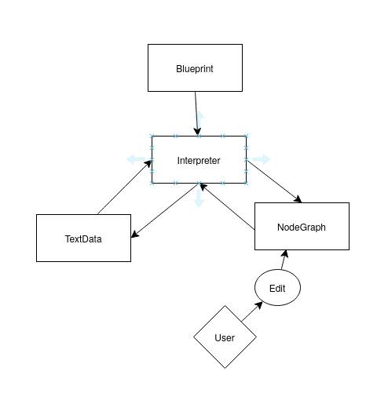

# Noodles

**WORK IN PROGRESS**

Noodles is a personal pet project aimed at creating a versatile translator that converts any data into an interactive node graph based on a user-defined blueprint. The idea is simple: you provide the data and a blueprint, and Noodles generates a node graph that you can then interact with to edit or explore the data.

## Vision

Initially, I'm focusing on supporting a few programming languages and common flowchart use cases. However, the long-term goal is to develop a blueprint system flexible and robust enough to handle virtually any type of "language" or data structure.

## Core Components

To make this work, I need to define:

- **The Blueprint System**: A framework for users to specify how data should be interpreted and structured.
- **The Node Graph Language**: A representation system for the graphs, which may borrow elements from the blueprints to ensure compatibility and expressiveness.

Stay tuned as I continue to build and refine this project!

